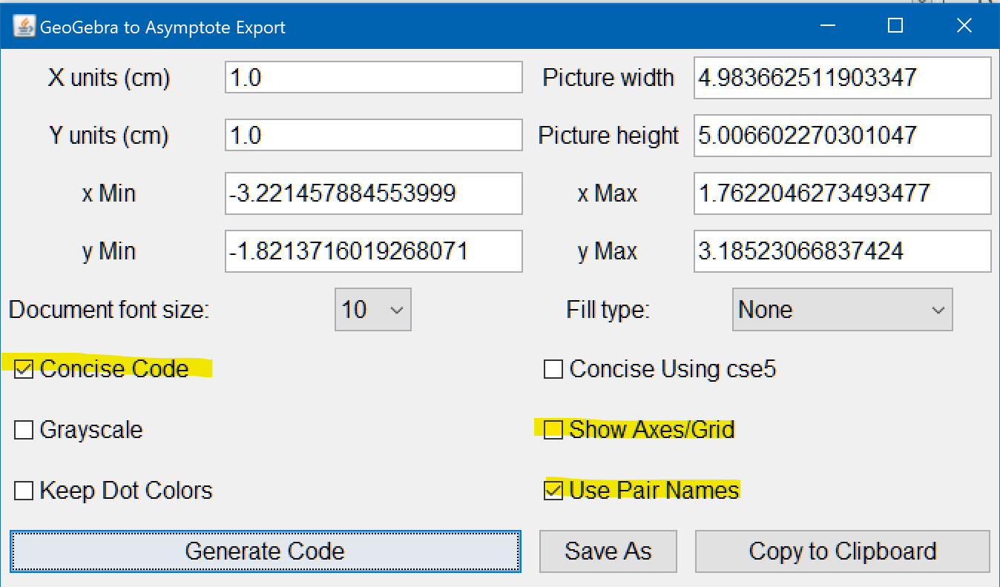

# Auxiliary Lines in Planar Geometry

This is a project initiated by Dr. Kai Zhu to translate this booklet on how to use auxiliary lines in planar geometry problems into English.

If you are interested in helping with the project, please read on.

## The Notebook

To work on the project, you can open the Jupyter Notebook, e.g. with [Google CoLab](https://colab.research.google.com/github/jameslao/Geometry/blob/main/Auxiliary%20Lines.ipynb) or your local [Jupyter Notebook](https://jupyter.readthedocs.io/en/latest/install.html) or [Jupyter Lab](https://jupyterlab.readthedocs.io/en/stable/getting_started/installation.html). If you need another hosted Jupyter environment, please contact the author.

## Drawings

The drawings are done with [Geogebra](https://www.geogebra.org/geometry), specifically, with GeoGebra Classic **5** ([Click to Download](https://download.geogebra.org/installers/5.0/GeoGebra-Windows-Installer-5-0-625-0.exe)), which offers much greater control over exports than its successor 6 does. To make sure the sizes are consistent in the final output, *the width of the drawings should be ~**3 in*** (This can be tricky to see if you use the web version of GeoGebra, but open the properties panel and you'll figure out). Please download the .ggb file from Geogebra and put it in the figures folder.

The *line width*s are set to **2**, *point size*s to **1**, and all colors to **Black**. To change the default settings in GeoGebra Classic 5, go to menu Options - Advanced - Defaults (4th button on the toolbar) and check all the entries there. 

The drawings are then exported to [Asymptote](https://asymptote.sourceforge.io/), which can only be done with GeoGebra Classic. 

Make sure you check the options (highlighted) as follows

The handling of image size in GeoGebra is pretty peculiar. The graphic elements always uses absolute coordinates in .asy, but the size of the imge is related to the zooming on the screen. To make sure the output is consistent, modify the `size(xxxx cm);` in the generated code to `size(6cm);` 

With the .asy file ready, we can convert it into PDF and SVG with Asymptote:

    asy -f pdf fig1.asy
    asy -f svg fig1.asy
    
Et voilà．You can insert the .svg file into the notebook.